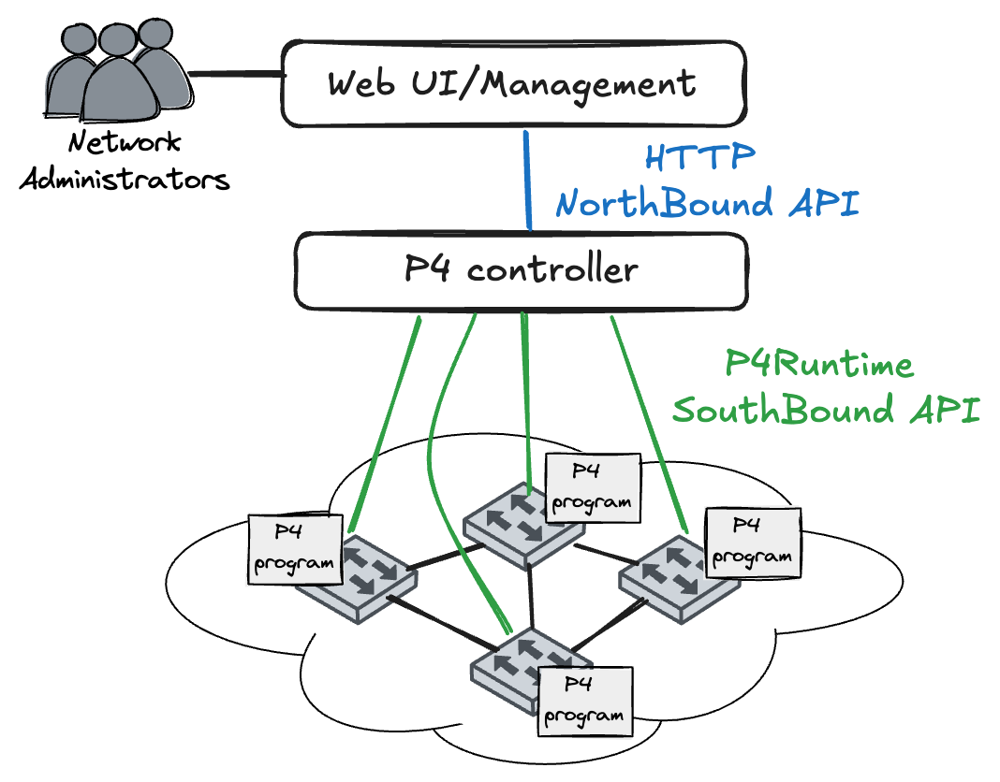

# Week 14 - NorthBound Interfaces and P4 Registers

The goal for this week is to allow you time to finish the practical work thus far and to introduce you to the final building block of P4 programming: **registers**. P4 registers are stateful memory elements that can be used to store and retrieve data across packets. We will use registers to construct a simple packet counter that counts the number of packets received from each source MAC address in order to create a very simple rate-limiting mechanism. **For this activity, you will need to carry on working with the code from week 13 and we are not ship a new template for this week.**

At the end of this week, you should be able to:

- [ ] Understand the concept of stateful memory in P4 and the use cases for registers.
- [ ] Implement a P4 program that uses registers to count packets based on source MAC addresses.
- [ ] Understand the concept of Northbound APIs in SDN and how they interact with the P4 runtime.
- [ ] Modify the controller to write register values and expose them via an HTTP API.


## Northbound Interfaces (Northbound APIs)



**Northbound Interface (NBI)** is the communication channel through which higher-level management systems (applications, orchestrators, controllers) interact with lower-level network controllers. In the SDN (Software-Defined Networking) architecture, it sits above the control plane, contrasting with **Southbound Interfaces** (like P4Runtime and OpenFlow) which communicate with the data plane switches. The northbound interface embodies a crucial principle in SDN: **separation of concerns**. This design philosophy decouples three layers. The **Application Layer** encompasses business logic such as security policies, QoS requirements, and traffic engineering. The **Control Layer** handles network orchestration through the controller or SDN applications. Finally, the **Data Plane** performs the actual packet forwarding on P4 switches.

Imagine the operator of a cloud computing. They typically need to manage using various controllers different types of resources in their infrastructures, e.g. VMs, Storage, Networking and apply policies that affect all these resources. The northbound interface allows the operator to write code that enforce policies, without needing to understand the low-level details of each controller or switch. This enables rapid innovation at the application layer without changing network hardware, and allows multiple applications to share the same infrastructure safely.

In this lab, we use Python (Flask)[https://flask.palletsprojects.com/en/2.3.x/] to implement a **Northbound Interface** for our controller. Instead of directly accessing the P4 switch (which would require knowing gRPC and P4Runtime), we expose an HTTP REST API that applications can use to interact with the controller. The architecture looks like this:

```
User Applications/Interfaces
       ↓ (HTTP REST API) ← Northbound Interface
   Controller (Python)
       ↓ (gRPC P4Runtime) ← Southbound Interface
   P4 Switch
```

This hierarchy allows a simple HTTP GET request to retrieve complex data from the switch without exposing the complexity of P4Runtime to the user. You can already use an NBI API method in your application to get the list of learnt MAC addresses from the controller. Below we include the Python implementaiton of the `/api/get_hosts` endpoint in the controller and a `curl` command to test it:

```python
@app.route('/api/get_hosts', methods=['GET'])
def get_hosts():
    """
    Returns all MAC addresses currently in the smac table.
    """
    return jsonify({
        'hosts': smac_table,
        'count': len(smac_table)
    })
```

```bash 
curl -X GET http://localhost:8080/api/get_hosts
```

The northbound interface provides simplicity, allowing users to GET the object `/api/get_pkt_count/mac/00:00:00:00:00:01` instead of crafting P4Runtime protocol buffers. It offers flexibility since we can change switch internals without affecting applications. Additionally, one controller can serve many applications via HTTP, and it integrates seamlessly with any web framework, monitoring tool, or dashboard.

## P4 Registers: Stateful Packet Processing

**P4 Registers** are stateful memory elements in the data plane that persist state across packets. While traditional switches forward packets based only on the current packet header (stateless), registers enable switches to remember information and make decisions based on history.

A register is essentially an array of values (typically 32 or 64 bits each) where each index can be read and written during packet processing:

```
┌─────────────────┐
│  Register[256]  │
├─────────────────┤
│ [0]:  5 packets │
│ [1]:  42 packets│
│ [2]:  1 packet  │
│ ...             │
│ [255]: 3 packets│
└─────────────────┘
```

### Adding Data Plane State with Registers

Traditionally, **switches are stateless**. They make forwarding decisions based solely on the current packet. State management happened in the control plane (controller) or applications. This simplifies switching but limits expressiveness. P4 registers fundamentally change this by asking: *"Why can't the switch itself remember things?"*

Registers enable a variety of practical applications in network labs. **Rate Limiting** uses registers to remember packet counts per source and drop exceeding thresholds. **SYN Flood Protection** tracks SYN packets per source to detect attacks. **Load Balancing** maintains a round-robin counter to distribute traffic across servers. **Heavy Hitter Detection** counts per-flow packets to mark and route high-volume flows accordingly. **Port Knocking** implements stateful firewall behavior by tracking connection sequences. The state typically stored in P4 registers, is what we call **soft state** — it can be lost on switch reboot and is not guaranteed to be consistent across multiple switches without additional mechanisms. This is in contrast to hard state, which is persistent and reliable, and typically maintained by the control plane.

Registers are powerful but come with important limitations. **Memory is finite**, with typically 256-64K entries available, reflecting a tradeoff where more state requires more chip area. **Controller reads are impractical in production** because P4Runtime register reads are slow and unsuitable for line-rate querying. **Distributed state** across switches must be carefully managed by the controller when replication is needed. This reflects P4's overarching philosophy: Make the switch smart enough for common cases, and keep the controller for exceptional cases.

To define a register in P4, you typically specify its size and width. We provide below the register structure, as defined in the p4 header files and an example register definition of a register to count packets per source MAC address.
```p4

extern register<T, I> {
    void read(out T result, in I index);
    void write(in I index, in T value);
}
```

Where `T` is the type of data stored (e.g., `bit<32>`) and `I` is the index type (e.g., `bit<32>`). You can then instantiate a register like this:

```p4
register<bit<32>>(256) packet_counter;

action count_packet(bit<8> host_id) {
    bit<32> current_count;
    packet_counter.read(current_count, host_id);
    packet_counter.write(host_id, current_count + 1);
}
```

This defines a register named `packet_counter` with 256 entries, each storing a 32-bit integer. In order to read or write to a register, you use the `read` and `write` methods within an action. And an action that increaments the register value by one. Notice the P4 syntax; a variable cannot be directly assigned the result of a `read` operation. Instead, you must pass the variable as an output parameter to the `read` method. Registers are defined in control blocks (e.g., `MyIngress`) and can be accessed in actions applied in tables.

> **Debugging P4 code**: To help with debugging your P4 code, you can use the `log_msg()` function to print messages to the switch log. This is useful for verifying that your register reads and writes are occurring as expected. For example:
> ```p4
> log_msg("Dropping packet from {} (count {})", {hdr.ethernet.srcAddr, current_count});
> ```
> Will print the following message on the switch log when a packet is dropped (found in `tmp/s1/stratum_bmv2.log`).
>
> ```
> 16:13:44.914] [bmv2] [D] [thread 142] [0.0] [cxt 0] Dropping packet from 00:00:00:00:00:02 (count 15)
> ```

## Task 1: P4 Rate limiter

For this week's lab, you will add one final feature to your P4 switch and controller: **Rate limiting**. It is common in a home setting for a household member to hog all the bandwidth by downloading large files or streaming high-definition videos. We will explore a very simple mechanism that will allow individual users to rate-limit specific MAC addresses. To realise this functionality, you will need to create and use 3 registers for each host: a packet counter, a timestamp of the last packet seen, and a drop flag. To simplify the implementation, we will exploit the well-formed nature of MAC addresses and only use the last byte of the MAC address as an index into our registers. This means that our implementation will only work for up to 256 unique MAC addresses.

### Step 1: Declare the Registers

First, you need to declare three registers in the `MyIngress` control block:

```p4
register<bit<32>>(256) packet_counter;  // Counts packets from each source MAC
register<bit<48>>(256) timestamp;       // Stores last packet time (microseconds)
register<bit<1>>(256) drop;             // Flag to indicate if packet should be dropped
```

These registers are indexed by the lower 8 bits of the source MAC address, giving us 256 possible entries (one for each unique last byte of a MAC address).

* *packet_counter*: Stores the number of packets received from each source MAC address in the last second.
* *timestamp*: Stores the timestamp of the start of the current time packet counting time window (in microseconds).
* *drop*: Flag to indicate if packets from a source MAC should be dropped.

### Step 2: Create the Rate Limit Action

The `rate_limit` action is responsible for incrementing the packet counter and setting the drop flag. Unfortunately, P4 on Stratum does not support conditional logic (if) inside actions, thus the action will count packets and record in the drop register whether the count exceeds the threshold. The drop register contain single bit entries (0 or 1) indicating whether to drop packets from that source MAC. To store information about whether to drop packets, you can use a logical expression based on the comparison of the count and rate threshold and cast the boolean outcome to a bit<1> value (e.g., `(bit<1>)(1 > 0)` will return 1).

### Step 3: Define the Threshold Table

Create a table that matches on source MAC addresses and applies the rate_limit action. By default, the table will apply the `NoAction` action, meaning no rate limiting is applied unless explicitly configured by the controller. The table can use the source MAC address of a packet monitor network usage and to look up the rate limit threshold for that MAC address. If no entry exists for a MAC address, the `NoAction` default action is applied (meaning no rate limiting and monitoring).

### Step 4: Implement the Rate Limiting Logic in the Apply Block

The main rate-limiting logic goes in the `apply` block of `MyIngress`, after the smac and dmac tables have been processed. The control block should extend the existing logic and include a lookup in the `threshold_table`, for packets that the controller already knows their source MAC address and the packet has a destination port. If there is a hit (*i.e.*, `if (threshold_table.apply().hit)` is true), it means rate limiting is configured for that source MAC address. The apply() method will have already added the packet to the counter and checked in the packet should be dropped. The apply logic should then read the current packet count, timestamp, and drop flag from the registers, and decide whether to drop the packet or reset the counter based on the current time. You can define inside the apply block local variables to hold the values read from the registers.

For time management, you can use the `standard_metadata.ingress_global_timestamp` field, which provides the current time in microseconds since the switch started. You will need to calculate the time difference between the current timestamp and the last recorded timestamp for that source MAC address. If more than 1 second (1,000,000 microseconds) has elapsed, you should reset the packet counter and update the timestamp. Do not forget that register are initialized to the zero value, so the first packet from a source MAC will have a timestamp of 0.

**How the Rate Limiting Could Works:**

1. **First Check**: Only apply rate limiting to packets where both source and destination MAC addresses are known (learned by the switch)

2. **Threshold Table Lookup**: Check if this source MAC has rate limiting configured by looking it up in `threshold_table`
   - If **miss**: No rate limiting for this MAC, packet proceeds normally
   - If **hit**: The `rate_limit` action runs, incrementing the counter and setting the drop flag

3. **Time Window Management**: 
   - Read the last timestamp for this MAC address
   - `standard_metadata.ingress_global_timestamp` provides the current time in **microseconds**
   - Calculate how much time has elapsed since the last packet

4. **Drop Decision**:
   - The `rate_limit` action already set the drop flag based on `count > rate`
   - If `drop_flag == 1`, mark the packet for dropping
   - This happens **before** we reset the counter, ensuring the current packet is affected

5. **Counter Reset**:
   - **First packet** (`last_time == 0`): Initialize the timestamp
   - **Time window expired** (`time_diff >= 1000000`): Reset counter to 0, update timestamp, clear drop flag
   - This implements a **sliding window** rate limiter with 1-second intervals

### Understanding the Time-Based Reset

The rate limiter uses a **1-second sliding window**:

```
Time:     0s          1s          2s          3s
          |-----------|-----------|-----------|
Packets:  ████████    ██          ██████████
Count:    8 (ok)      2 (ok)      10 (DROP!)
          ^reset      ^reset      ^reset
```

- Every second, the counter resets to 0
- If a host sends more than the threshold within any 1-second window, excess packets are dropped
- The counter is incremented **before** checking the drop flag, so the packet that exceeds the limit is the first to be dropped

## Task 2: Controller Northbound API

Let's now design a simple HTTP API to interact with our rate-limiting P4 switch. We will implement three endpoints to manage rate limiting through the controller:

1. `GET /api/get_hosts`: Retrieves a list of all MAC addresses learnt by the controller (already implemented)
2. `GET /api/set_rate_limit/<mac_address>/<pkt_threshold>`: Configures rate limiting for a specific MAC address
3. `GET /api/unset_rate_limit/<mac_address>`: Removes rate limiting for a specific MAC address

> **Important Note on P4Runtime Limitations**: Unfortunately, the P4Runtime API implementation used in this lab does not support reading register entries directly. This is an implementation-specific limitation, not a fundamental restriction of P4Runtime specifications. Therefore, we design our API to avoid read operations from the controller to the switch, focusing only on write operations. The P4 community often addresses this challenge by using PacketOut and PacketIn messages to perform read operations indirectly. However, this approach is more complex and beyond the scope of this lab, and is left for interested students to explore independently.

### Endpoint 1: Get Hosts (`GET /api/get_hosts`)

This endpoint is **already implemented** and serves as an example of how to expose switch state through the Northbound API:

```python
@app.route('/api/get_hosts', methods=['GET'])
def get_hosts():
    """
    Returns all MAC addresses currently in the smac table.
    """
    return jsonify({
        'hosts': smac_table,
        'count': len(smac_table)
    })
```

**How it works:**
- Returns the `smac_table` list maintained by the controller
- Includes a count of total hosts
- Response format: `{"hosts": ["00:00:00:00:00:01", "00:00:00:00:00:02"], "count": 2}`

**Testing:**
```bash
curl -X GET http://localhost:8080/api/get_hosts
```

### Endpoint 2: Set Rate Limit (`GET /api/set_rate_limit/<mac_address>/<pkt_threshold>`)

This endpoint configures rate limiting for a specific MAC address by adding an entry to the `threshold_table` in the P4 switch:

```python
@app.route('/api/set_rate_limit/<mac_address>/<int:new_count>', methods=['GET'])
def set_rate_limit(mac_address, new_count):
    """
    Sets packet count threshold for a specific MAC address.
    Creates an entry in the threshold_table that triggers rate limiting.
    """
    global s1, p4info_helper
    
    # Check if switch connection is available
    if s1 is None or p4info_helper is None:
        return jsonify({
            'error': 'Switch connection not established'
        }), 500
    
    print(f"Setting rate limit for MAC {mac_address} to {new_count} packets/second")
    
    try:
        # TODO: Build table entry for threshold_table
        
        # TODO: Write entry to switch via P4Runtime

        
        return jsonify({
            'mac': mac_address,
            'rate_limit': new_count,
            'status': 'configured'
        })
        
    except Exception as e:
        print(f"Error setting rate limit: {e}")
        return jsonify({
            'error': str(e)
        }), 500
```

**How it works:**
1. Extracts `mac_address` and `new_count` from the URL path
2. Uses `p4info_helper.buildTableEntry()` to construct a P4Runtime table entry, similar to the week 13 controller implementation
3. Specifies:
   - **Table**: `MyIngress.threshold_table`
   - **Match field**: Source MAC address (exact match)
   - **Action**: `MyIngress.rate_limit` with parameter `rate = new_count`
4. Writes the entry to the switch using `s1.WriteTableEntry()`
5. Returns JSON confirmation or error message

**Testing:**
```bash
# Set rate limit to 10 packets/second for MAC 00:00:00:00:00:01
curl -X GET http://localhost:8080/api/set_rate_limit/00:00:00:00:00:01/10

# Expected response:
# {"mac": "00:00:00:00:00:01", "rate_limit": 10, "status": "configured"}
```

### Endpoint 3: Unset Rate Limit (`GET /api/unset_rate_limit/<mac_address>`)

This endpoint removes rate limiting for a MAC address by deleting its entry from the `threshold_table`:

```python
@app.route('/api/unset_rate_limit/<mac_address>', methods=['GET'])
def unset_rate_limit(mac_address):
    """
    Removes rate limiting for a specific MAC address.
    Deletes the entry from threshold_table.
    """
    global s1, p4info_helper
    
    if s1 is None or p4info_helper is None:
        return jsonify({
            'error': 'Switch connection not established'
        }), 500
    
    print(f"Removing rate limit for MAC {mac_address}")
    
    try:
        # TODO: Build the same table entry (needed for deletion)
        
        # TODO: Delete entry from switch
        
        return jsonify({
            'mac': mac_address,
            'status': 'removed'
        })
        
    except Exception as e:
        print(f"Error removing rate limit: {e}")
        return jsonify({
            'error': str(e)
        }), 500
```

**How it works:**
1. Builds a table entry matching the MAC address (same as set_rate_limit)
2. Uses `s1.DeleteTableEntry()` instead of `WriteTableEntry()`
3. When the entry is deleted, `threshold_table.apply()` will return a **miss** for this MAC
4. The P4 `apply` block will not execute rate-limiting logic for this MAC anymore

**Testing:**
```bash
# Remove rate limit for MAC 00:00:00:00:00:01
curl -X GET http://localhost:8080/api/unset_rate_limit/00:00:00:00:00:01

# Expected response:
# {"mac": "00:00:00:00:00:01", "status": "removed"}
```

### Complete Workflow Example

Here's how to test the complete rate-limiting system:

```bash
# 1. Start the controller
python3 controller.py

# 2. In another terminal, check learned hosts
curl -X GET http://localhost:8080/api/get_hosts
# Response: {"count": 2, "hosts": ["00:00:00:00:00:01", "00:00:00:00:00:02"]}

# 3. Set rate limit for h1 (10 packets/second)
curl -X GET http://localhost:8080/api/set_rate_limit/00:00:00:00:00:01/10

# 4. Generate traffic from h1 in Mininet (flag -i controls the interval between consecutive pings)
mininet> h1 ping -c 100 h2 -i 0.1

# 5. Observe in controller logs: packets will be dropped after the 10th packet per second

# 6. Remove rate limit
curl -X GET http://localhost:8080/api/unset_rate_limit/00:00:00:00:00:01

# 7. Traffic now flows normally again
```

## Summary: Putting It All Together

During the last four weeks in lab activities we demonstrated the complete SDN architecture stack, from data plane programmability to application-layer APIs:

```
┌─────────────────────────────────────────┐
│   Applications / Users                  │
│   (curl, web dashboards, scripts)       │
└───────────────┬─────────────────────────┘
                │ HTTP REST API (Northbound)
                ▼
┌─────────────────────────────────────────┐
│   Controller (controller.py)            │
│   - Flask HTTP Server                   │
│   - P4Runtime gRPC Client               │
│   - Learning Switch Logic               │
│   - MAC Table Management                │
└───────────────┬─────────────────────────┘
                │ P4Runtime gRPC (Southbound)
                ▼
┌─────────────────────────────────────────┐
│   P4 Switch (main.p4)                   │
│   - Parser (Ethernet)                   │
│   - Ingress Processing                  │
│     • smac table (source learning)      │
│     • dmac table (destination forward)  │
│     • threshold_table (rate limiting)   │
│     • Registers (packet_counter,        │
│                 timestamp, drop)        │
│   - Egress Processing                   │
│   - Deparser                            │
└─────────────────────────────────────────┘
```

### Common Pitfalls and Debugging Tips

**Problem**: Rate limiting doesn't work

- **Check 1**: Is the MAC address in `smac_table`? Run `/api/get_hosts`
- **Check 2**: Is there a `threshold_table` entry? Check controller logs for "Setting rate limit"
- **Check 3**: Are packets reaching the switch? Use `log_msg()` in P4 code
- **Check 4**: Is the counter resetting? Time window might be expiring between test packets

**Problem**: All packets are dropped immediately

- **Check**: Did you set the threshold too low? Try `/api/set_rate_limit/MAC/100` for testing
- **Issue**: Counter might not be reset. Check timestamp register initialization

**Problem**: API returns "Switch connection not established"

- **Fix**: Ensure controller is running and has completed P4 program installation
- **Wait**: Controller takes a few seconds to establish gRPC connection at startup

**Problem**: MAC address not learned by switch

- **Cause**: No traffic from that host yet
- **Solution**: Generate traffic using `ping` in Mininet before setting rate limit

### Extensions and Further Exploration

**Advanced Rate Limiting**:

- Implement token bucket algorithm instead of simple counter
- Add burst allowance (allow N packets instantly, then rate-limit)
- Use cryptographic hash for better index distribution

**Better State Management**:

- Implement PacketIn/PacketOut pattern to read register values
- Add API endpoint to query current packet counts
- Export register state to external monitoring system (Prometheus, Grafana)

**Multi-Switch Deployment**:

- Synchronize registers across multiple switches via controller
- Implement distributed rate limiting (aggregate across switches)

**Integration with Real Applications**:

- Connect API to web dashboard for visual rate-limit management
- Implement automatic rate limiting based on traffic patterns (ML integration)
- Add authentication and authorization to Northbound API

## Useful Links

* [P4 Language Specification](https://p4.org/p4-spec/docs/P4-16-v1.3.0-spec.html)
* [P4Runtime Specification](https://p4.org/p4-spec/docs/P4Runtime-v1.2.0-spec.html)
* [gRPC Documentation](https://grpc.io/docs/)
* [Protocol Buffers Documentation](https://developers.google.com/protocol-buffers)
* [P4 Tutorial](http://github.com/p4lang/tutorials)